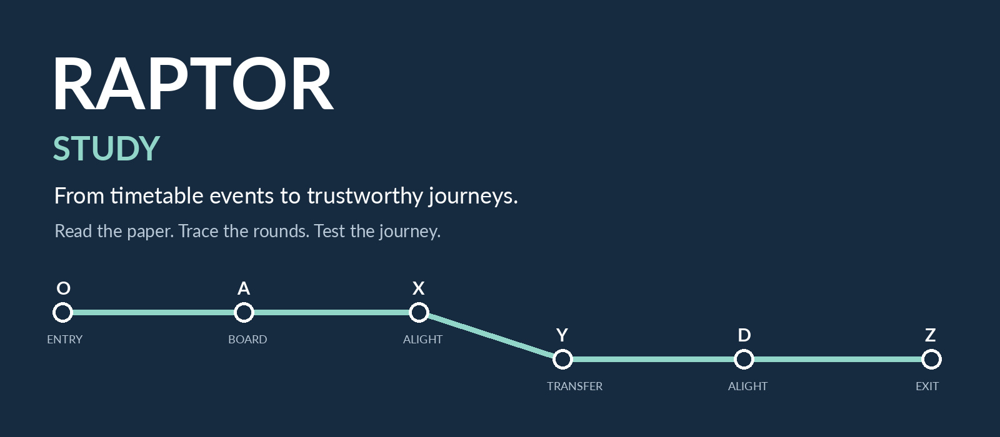
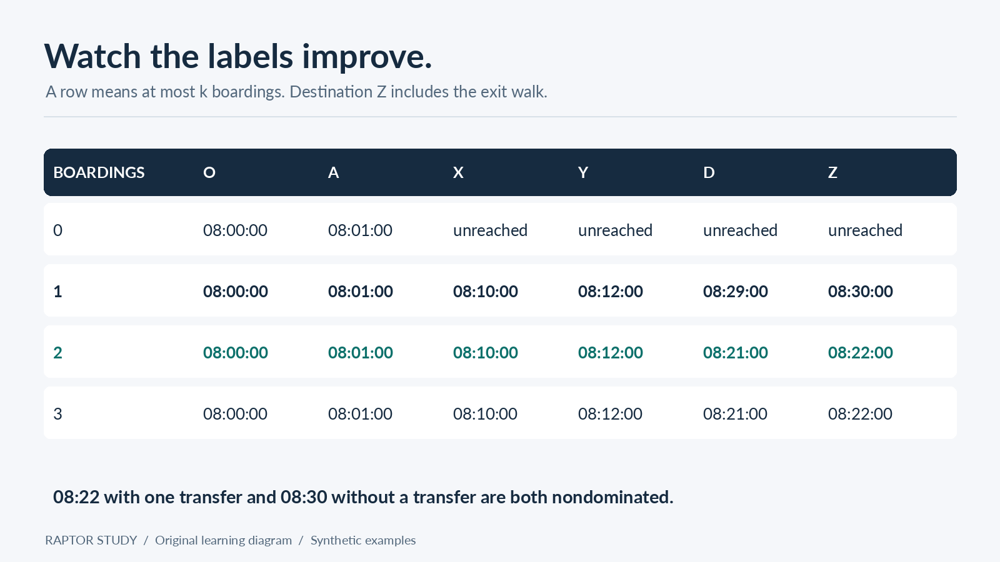
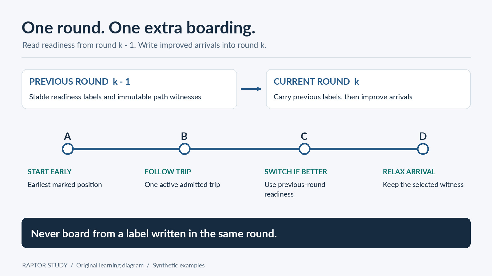
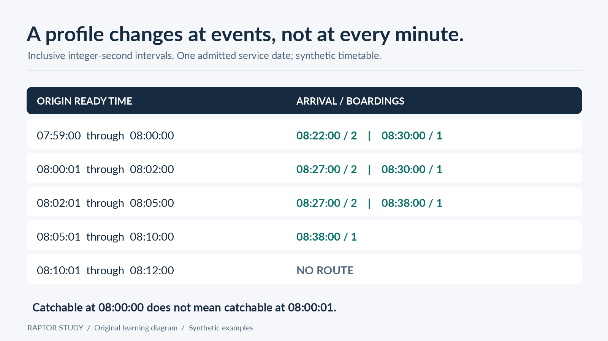

# RAPTOR Study

[English](README.md) | **한국어**



**이 저장소 안에서 설명과 실습을 완결하는 라운드 기반 대중교통 경로 탐색 가이드입니다.**

Python 3.11+ · MIT · 한국어 · 알고리즘 실행 시 외부 의존성 없음

먼저 개념을 이해하고, 작은 네트워크를 손으로 따라간 다음 코드를 실행합니다. 이후 운행일, 도보, 접근성, 실시간 데이터의 식별 정보, 용량 제한이 있는 후보 집합, 실패를 숨기지 않는 동작을 알고리즘과 연결합니다.

여기서 **RAPTOR는 대중교통 경로 탐색 알고리즘**을 뜻합니다. 이름이 비슷한 언어 모델용 검색 기법이 아닙니다. 이 저장소에는 직접 작성한 설명과 작은 실행 가능한 구현이 있습니다.

> **학습 원칙.** 모든 설명은 이 저장소의 본문·코드·예제·테스트만으로 따라갈 수 있어야 합니다. 논문과 표준 링크는 선택적인 배경 자료입니다. 구현된 동작과 확장 아이디어를 명확히 구분합니다. 시간표, 식별자, 해시 형태의 값은 모두 가상의 테스트 데이터입니다.

영어 [README.md](README.md)가 기본 문서입니다. 이 문서는 한국어 번역이며, 연결된 상세 장·노트북·이미지 내부 설명은 영어로 제공됩니다.

## 목차

1. [대중교통 탐색에 라운드가 필요한 이유](#1-대중교통-탐색에-라운드가-필요한-이유)
2. [수식보다 먼저 이해할 직관](#2-수식보다-먼저-이해할-직관)
3. [라벨과 라운드 그리고 핵심 점화식](#3-라벨과-라운드-그리고-핵심-점화식)
4. [표시된 노선과 하나의 활성 운행편](#4-표시된-노선과-하나의-활성-운행편)
5. [시각은 운행일에 속한다](#5-시각은-운행일에-속한다)
6. [도보와 접근성도 여정의 일부다](#6-도보와-접근성도-여정의-일부다)
7. [이 저장소에서 여정 계산 따라가기](#7-이-저장소에서-여정-계산-따라가기)
8. [가장 빠른 라벨만으로는 후보 집합이 완성되지 않는 이유](#8-가장-빠른-라벨만으로는-후보-집합이-완성되지-않는-이유)
9. [출발 프로파일과 도착 시각 기준 탐색 그리고 마지막 연결편](#9-출발-프로파일과-도착-시각-기준-탐색-그리고-마지막-연결편)
10. [목적을 정하고 논문 읽기](#10-목적을-정하고-논문-읽기)
11. [저장소 구조와 학습 순서](#11-저장소-구조와-학습-순서)
12. [예제와 테스트 실행](#12-예제와-테스트-실행)
13. [실습을 넘어 실제 서비스로](#13-실습을-넘어-실제-서비스로)
14. [참고 자료와 출처](#14-참고-자료와-출처)

## 1. 대중교통 탐색에 라운드가 필요한 이유

노선도는 선로가 어디로 이어지는지 알려줍니다. 시간표는 실제로 열차에 탈 수 있는지 알려줍니다. 둘은 다른 질문입니다.

08:01에 승강장에 도착했다면 지도에서 가장 짧은 경로라도 08:00에 출발한 열차에는 탈 수 없습니다. 다른 열차는 더 일찍 도착하지만 환승이 한 번 더 필요할 수 있습니다. 계단 없는 여정에서는 엘리베이터 동선이 단순한 선호가 아니라 필수 조건일 수도 있습니다.

RAPTOR는 **차량에 몇 번 탑승했는지**를 기준으로 탐색을 구성합니다. 그래서 도착 시각과 환승 횟수의 절충을 쉽게 살펴볼 수 있습니다. Delling, Pajor, Werneck이 2012년 논문 [Round-Based Public Transit Routing](https://www.microsoft.com/en-us/research/publication/round-based-public-transit-routing/)에서 소개했습니다. 논문의 노선 스캔은 한 라운드에서 영향을 받은 노선을 최대 한 번 방문하며, 도로 형태의 그래프에 대한 다익스트라 탐색이 아닙니다.

시간표 컴파일이 사라지는 것은 아닙니다. 정류장 인덱스, 스캔 패턴, 운행 달력의 입력 수용 검증, 신뢰할 수 있는 입력은 여전히 중요합니다. 기본 탐색을 표현하기 위해 무거운 그래프 지름길 전처리에 의존하지 않는다는 뜻입니다.

중요한 질문은 “빠른 열차를 찾을 수 있는가?”보다 넓습니다. “계산이 설명 가능하고 접근성을 충족하며 식별 정보가 일관된 여정을 반환하거나, 여정을 지어내지 않고 실패할 수 있는가?”입니다.

[적용 모델 결정표](docs/00_why_transit_needs_raptor.md#decide-which-raptor-model-the-request-needs)에서 단일 시점·구간·역방향·다기준 탐색의 요구사항, 입력 가정, 실습에서 제공하는 검증 근거를 먼저 구분하세요.

## 2. 수식보다 먼저 이해할 직관

아래는 가상의 네트워크입니다. `O`와 `Z`는 역 밖의 출발·도착 지점이며, `A`, `X`, `Y`, `D`는 승강장 측 노드입니다. 실제 역 ID가 아닙니다.

```text
O --ENTRY 60s--> A --R1--> X --TRANSFER 120s--> Y --R2--> D --EXIT 60s--> Z
                  \---------------- DIRECT ------------------/
```

테스트 데이터에는 `X`에서 `Y`로 이동하는 30초짜리 계단 환승도 있습니다. 엄격한 계단 없는 이동 모드에서는 제외합니다. 예제의 탑승 여유 시간은 **이 실습용으로 정한 60초**입니다.

08:00에 `O`에서 출발하면 다음과 같습니다.

| 단계 | 확인한 내용 | 목적지 도착 |
|---|---|---|
| 라운드 0 | `O`에서 `A`까지 도보 이동, 아직 탑승하지 않음 | 미도달 |
| 라운드 1 | 직통 열차를 포함한 1회 탑승 | 08:30 |
| 라운드 2 | 검증된 환승을 거치는 2회 탑승 | 08:22 |
| 라운드 3 | 개선 없음 | 여전히 08:22 |

환승 한 번으로 08:22에 도착하는 여정과 환승 없이 08:30에 도착하는 여정은 모두 유용합니다. 어느 쪽도 도착 시각과 환승 횟수 모두에서 우월하지 않습니다.

“최적 경로가 22분이니 나머지를 버리자”는 이미 제품의 순위 결정입니다. 먼저 가능한 대안을 구한 다음, 계약에 정의된 후보 집합과 표시 정책을 적용해야 합니다.

## 3. 라벨과 라운드 그리고 핵심 점화식

$\tau_k(s)$를 **최대 $k$회 탑승**으로 정류장 $s$에 도착할 수 있는 현재까지의 가장 이른 시각이라고 하겠습니다. 도달할 수 없는 정류장의 값은 $\infty$입니다.

출발 준비 시각과 허용된 모든 도보 도달 지점으로 라운드 0을 초기화합니다. 이후 각 라운드를 시작할 때 이전 라운드의 값을 유지합니다.

$$\tau_k(s) \leftarrow \tau_{k-1}(s).$$

$d(t,i)$는 운행편 $t$의 위치 $i$에서의 출발 시각, $a(t,i)$는 해당 위치의 도착 시각입니다. 다음 조건을 만족해야 탑승할 수 있습니다.

$$\tau_{k-1}(s_i) + b \leq d(t,i),$$

여기서 $b$는 탑승 여유 시간입니다. 이후 하차가 허용된 위치 $j$에 대해 갱신합니다.

$$\tau_k(s_j) \leftarrow \min\left(\tau_k(s_j),a(t,j)\right).$$

그다음 탑승 횟수를 늘리지 않고 허용된 도보 경로를 끝까지 전파합니다. 자세한 내용은 [라운드·라벨·파레토](docs/01_rounds_labels_and_pareto.md)를 참고하세요.

첨자에 주의하세요. **탑승 라벨은 현재 쓰고 있는 라운드가 아니라 $k-1$ 라운드에서 읽어야 합니다.** 그렇지 않으면 같은 반복문에서 나중에 스캔한 노선이 두 번째 탑승을 같은 라운드에 끼워 넣을 수 있습니다.

한 번 이상 탑승하는 여정에서는 다음 관계가 성립합니다.

$$\text{transfers}=\text{boardings}-1.$$

도보만 이용하는 여정의 환승 횟수는 0입니다. 명령줄 예제는 최대 2회 환승을 최대 3회 탑승으로 변환합니다. 실습 API는 단위를 드러내기 위해 제한값의 이름을 `max_boardings`로 정했습니다.



## 4. 표시된 노선과 하나의 활성 운행편

모든 정류장에서 모든 운행편을 스캔하면 작업이 낭비됩니다. 라운드가 끝나면 라벨이 개선된 정류장을 표시합니다. 해당 정류장을 지나는 각 노선에서 가장 앞선 표시 **위치**를 기억하고, 그 노선을 한 번 스캔합니다.

스캔 패턴은 단순한 노선명이 아닙니다. 정류장 순서가 같고 승하차 허용 조건이 호환되는 운행편을 묶습니다. 이 구현은 모든 위치에서 운행편 간 추월이 없는 순서도 요구합니다. 컴파일러는 잘못된 최적화를 조용히 실행하는 대신 호환되지 않는 그룹을 거부합니다.

순방향 스캔 중에는 현재 탑승한 운행편 하나를 유지합니다. 다음 정류장에서 먼저 도착 라벨을 갱신한 뒤, 이전 라운드의 값으로 그곳에서 더 이른 운행편에 탈 수 있는지 확인합니다. 가능하다면 활성 운행편과 변경 불가능한 경로 증거를 함께 교체합니다.

핵심 코드는 [노선 인덱스](src/route_index.py), [노선 스캔](src/route_scan.py), [라운드 실행부](src/raptor.py)로 나뉩니다. 덕분에 정확성 증명의 가정이 코드의 어느 부분에 들어가는지 확인하기 쉽습니다.

순환 노선은 특히 주의해야 합니다. 패턴이 `A`를 두 번 방문하면 정류장 ID가 같아도 서로 다른 위치입니다. 인덱스는 각 방문을 모두 저장하며 하나의 역 조회로 합치지 않습니다.



## 5. 시각은 운행일에 속한다

`24:06:00`은 자정이 지난 6분이지만 여전히 전날 운행일의 시간표에 속한다는 유효한 표현입니다. `% 86400`으로 `00:06:00`으로 바꾸면 그 관계가 사라집니다.

[GTFS Schedule 참조](https://gtfs.org/documentation/schedule/reference/#field-types)는 24시를 넘는 운행 시각을 설명합니다. 실습은 정수 초를 저장하고 Asia/Seoul 기준의 명시적 날짜 변환을 제공합니다. 범용 GTFS 가져오기 도구나 전 세계 일광 절약 시간 처리 엔진은 아닙니다.

```python
from datetime import date
from src.service_time import parse_time, service_instant

seconds = parse_time("24:06:00")
assert seconds == 86760
assert service_instant(date(2026, 9, 7), seconds).isoformat() == "2026-09-08T00:06:00+09:00"
```

운행 달력 예외, 운행일 경계를 넘는 조회 구간, 전날 시작한 운행편, 배차 간격의 의미, 실시간 정보 적용 가능성은 질의가 사용할 수 있는 열차를 결정합니다. 화면 표시 형식으로 고칠 수 있는 문제가 아닙니다. 실습은 주어진 운행일 하나를 다루며, 여러 운행일로 확장할 때 필요한 작업은 [운행일과 시간표](docs/03_service_days_and_timetables.md)에서 설명합니다.

## 6. 도보와 접근성도 여정의 일부다

여정은 첫 열차 탑승 전에 시작하고 마지막 승강장 도착 후에 끝납니다. 테스트 데이터는 ENTRY·TRANSFER·EXIT를 방향이 있는 간선으로 표현하므로 목적지 도착 시각에는 마지막 출구까지의 도보 이동도 포함됩니다.

도보 경로의 전이적 도달 범위를 끝까지 계산하는 것이 중요합니다. `A -> B`와 `B -> C`가 있어도 간선을 임의의 순서로 한 번만 순회하면 `C`를 찾지 못할 수 있습니다. 이 실습은 힙으로 최단 도보 경로를 전파합니다. 음수가 아닌 임의의 도보 그래프를 처리하기 위한 구현 선택이며, 대중교통 노선 스캔을 다익스트라로 바꾸는 것은 아닙니다.

엄격한 계단 없는 이동 모드에서는 확인된 계단을 제외합니다. 근거가 없거나 검증되지 않았다면 실습의 보수적인 스냅샷 전체 정책에 따라 명시적인 오류 유형으로 입력 수용에 실패합니다. 질의와 무관한 간선의 근거가 불명확해도 거절하며, 관련 범위의 근거만 선택하는 기능은 구현하지 않았습니다.

정류장·라운드마다 라벨 하나만 두어도 되는 이유는 요청 내 도보 시간과 탑승 여유 시간이 고정되고, 대기가 허용되며, 탐색 목표가 도착 시각과 탑승 횟수이기 때문입니다. 진입 노선별 환승 규칙이나 경로에 따라 달라지는 접근성은 더 풍부한 상태를 요구할 수 있습니다. 역 단위 상수에 숨기지 마세요.

실제 데이터에 적용하기 전에 [환승·접근성·식별 정보](docs/05_transfers_accessibility_and_identity.md)를 읽어보세요.

## 7. 이 저장소에서 여정 계산 따라가기

[example_routing.py](example_routing.py)에서 시작해 같은 입력이 다음 단계를 통과하는 과정을 따라가세요.

| 단계 | 로컬 구현 | 책임 |
|---|---|---|
| 입력 구성 | [fixtures.py](src/fixtures.py), [timetable.py](src/timetable.py) | 가상 열차와 방향 있는 도보 간선을 구성하고 잘못된 입력 거절 |
| 인덱스 컴파일 | [route_index.py](src/route_index.py) | 정류장 등장 위치와 열차 출발 시각 배열 기록 |
| 질의 수용 | [accessibility.py](src/accessibility.py), [raptor.py](src/raptor.py) | 질의 범위와 도보 근거 검증 |
| 계산 | [raptor.py](src/raptor.py), [route_scan.py](src/route_scan.py), [footpaths.py](src/footpaths.py) | 탑승 라운드 하나를 스캔하고 허용된 도보 경로 전파 |
| 설명과 검증 | [round_state.py](src/round_state.py), [journey.py](src/journey.py) | 대안 여정을 추출하고 경로가 실제 입력에 존재하는지 검증 |

[전체 흐름을 다루는 장](docs/04_easysubway_end_to_end.md)은 08:00 질의를 이 함수들로 추적하며 빈 결과와 계산 실패의 차이도 설명합니다.

## 8. 가장 빠른 라벨만으로는 후보 집합이 완성되지 않는 이유

같은 정류장의 두 라벨을 비교해 봅시다. 하나는 오래 걸어서 08:10에 도착하고, 다른 하나는 훨씬 적게 걸어서 08:11에 도착합니다. 실습의 가정 아래 가장 이른 도착만 목표로 한다면 첫 번째만 남겨도 됩니다. 하지만 최소 도보 대표 경로를 보존하기에는 부족합니다.

[pareto.py](src/pareto.py)의 `Objective`는 출발 시각, 도착 시각, 탑승 횟수, 도보, 접근성 부담, 연결 여유 시간을 다룹니다. 이는 비지배 대안을 보존하는 별도 실습이며, 스칼라 라우터가 이 목적을 모두 최적화한다는 뜻은 아닙니다.

다음 세 가지는 구분해야 합니다.

```text
화면에 공개하는 추천 수 != 내부 상태 후보 집합의 용량 != 프로파일 작업 예산
```

독립적인 [후보 집합 모듈](src/pareto.py)은 지배 관계, 목적 벡터 중복 제거, 용량 손실 시 실패를 보여줍니다. 모든 비지배 벡터를 유지하거나 `RAPTOR_FRONTIER_CAPACITY_EXCEEDED`를 발생시킵니다. 단일 라벨 노선 스캔을 완전한 McRAPTOR로 바꾸지는 않으며 승객에게 보여줄 추천 정책도 정의하지 않습니다.

`python example_walking_tradeoff.py`를 실행하면 중간 정류장에서 대안을 잃는 구체적인 사례를 볼 수 있습니다. 단일 값 기반 경로는 8초를 걸어 시각 30에 도착하지만, 같은 탑승 횟수의 다른 유효한 경로는 1초만 걸어 시각 35에 도착합니다. 두 경로 모두 입력과 대조해 검증합니다. 노트북 03은 목적지에서만 정렬해도 버려진 대안을 복원할 수 없는 이유를 보여줍니다.

앱이 추천을 최대 3개 보여준다는 이유만으로 `frontier[:3]`을 안전하다고 간주하면 안 됩니다. 버려진 네 번째 내부 라벨이 이후 연결편을 이용할 수 있는 유일한 후보일 수 있습니다.

## 9. 출발 프로파일과 도착 시각 기준 탐색 그리고 마지막 연결편

출발 프로파일은 출발 준비 시각의 구간에 따라 무엇이 달라지는지 묻습니다. 실습의 [rRAPTOR 구현](src/profile.py)은 실제 탑승 가능 경계 이벤트를 구해 늦은 시각부터 처리하고, 라운드별 라벨을 유지하며, 표시된 영향 노선을 스캔합니다. `raptor()`를 반복 호출하거나 매분 샘플링하지 않습니다.

탑승 여유 시간이 60초인 엄격한 접근성 테스트 데이터에서는 다음과 같습니다.

| 출발 준비 시각 구간, 양 끝 포함 | 도착 시각 / 탑승 횟수 대안 |
|---|---|
| 07:59:00–08:00:00 | 08:22 / 2; 08:30 / 1 |
| 08:00:01–08:02:00 | 08:27 / 2; 08:30 / 1 |
| 08:02:01–08:05:00 | 08:27 / 2; 08:38 / 1 |
| 08:05:01–08:10:00 | 08:38 / 1 |
| 08:10:01–08:12:00 | 가능한 여정 없음 |

초 단위 경계가 중요합니다. 08:00:00에 탈 수 있는 열차를 08:00:01에는 놓칠 수 있습니다.



[역방향 구현](src/reverse.py)은 노선을 뒤에서부터 스캔하고 유입 간선 인덱스를 사용해 지정 시각까지 도착하는 arrive-by 질의에 답합니다. 실제로 존재하지 않는 역방향 보행로를 만들지 않습니다. 마지막 연결편 탐색은 수용된 운행일의 실제 이벤트 범위를 검색합니다. 단순히 “23:59에 검색”한다는 뜻이 아닙니다.

실행 가능한 프로파일은 하나의 수용된 운행일, 고정된 도보 조건, 도착 시각·탑승 횟수 목표, 대중교통 이용이 필요한 출발지·목적지 쌍으로 제한됩니다. 도보 전용 프로파일에는 상수 구간만이 아니라 출발 시각에 비례해 도착 시각이 변하는 아핀 구간도 필요하므로, 실습은 지원하지 않는 이 영역을 명시적으로 거부합니다. arrive-by와 단일 시점 질의는 도보 전용 여정도 지원합니다.

더 넓은 엔진에는 여러 운행일의 운행편 선택, 도보 전용 프로파일의 일차함수 구간, 중간 정류장의 다기준 상태가 필요합니다. [06장](docs/06_departure_profiles_and_reverse_search.md)은 현재 표현으로 이 동작을 제공할 수 없는 이유를 설명합니다.

## 10. 목적을 정하고 논문 읽기

[공식 논문 페이지](https://www.microsoft.com/en-us/research/publication/round-based-public-transit-routing/)와 저장소의 [직접 작성한 읽기 가이드](papers/raptor_reading_companion.pdf)를 함께 열어보세요. 가이드는 자체 설명 자료이며 **연구 논문을 재배포한 사본이 아닙니다.**

첫 번째 읽기에서는 상태에 집중하세요. 라벨이 무엇을 뜻하고 라운드는 무엇을 읽을 수 있나요? 두 번째에는 테스트 데이터로 노선 스캔을 따라가세요. 세 번째에는 논문의 환승 가정과 실습의 명시적인 도보 전파를 비교하세요. 이후 출발 시각이나 다른 기준을 문제에 추가할 때 어떤 정보를 더 유지해야 하는지 질문하며 확장을 읽어보세요.

불변 조건과 최적화를 구분하는 습관이 중요합니다. “이전 라운드에서만 탑승한다”는 의미를 지키는 규칙입니다. “출발 시각 배열을 이진 탐색한다”는 정렬 가정에 근거한 구현 선택입니다.

이 저장소는 장식용이거나 검증할 수 없는 인용 대신 직접 작성한 설명과 계산 예제를 사용합니다.

## 11. 저장소 구조와 학습 순서

9개 장, 3개 노트북, 실행 가능한 예제, 범위를 좁힌 테스트를 연결한 학습 과정입니다. 각 구성 요소는 RAPTOR의 불변 조건이나 입력 검증 경계를 설명합니다. 파일 개수 제한 없이 새 학습 자료를 추가할 수 있습니다.

```text
raptor-study/
├── .gitignore
├── LICENSE
├── README.md
├── README.ko.md
├── example_journey_profiles.py
├── example_routing.py
├── example_walking_tradeoff.py
├── .github/workflows/ci.yml
├── tools/verify_notebooks.py
├── pytest.ini
├── requirements.txt
├── requirements-ci.txt
├── assets/       # 도해 5개: JPG 3개, PNG 2개
├── docs/         # 00–08, 총 9개 장
├── notebooks/    # 01–03, 실행 가능한 노트북 3개
├── papers/       # 직접 작성한 읽기 가이드 PDF 1개
├── src/          # Python 모듈 17개
└── tests/        # 불변 조건, 원시 입력 경로 증거, 절충 관계, 오라클 일치 검증
```

[학습 자료 지도](docs/08_correctness_performance_and_study_plan.md#learning-resource-map)는 개념을 실행 가능한 근거와 연결합니다. `test_structure.py`는 추가 파일을 허용하면서 필수 자료와 학습 자료 링크를 보호합니다. 노트북 실행은 별도의 CI 검사입니다.

| 단계 | 읽을 자료 | 실행하거나 살펴볼 항목 |
|---|---|---|
| 직관 만들기 | [00 — 대중교통에 RAPTOR가 필요한 이유](docs/00_why_transit_needs_raptor.md) | `example_routing.py` |
| 불변 조건 추적 | [01 — 라운드와 라벨](docs/01_rounds_labels_and_pareto.md) | 노트북 01 |
| 스캔 이해 | [02 — 표시된 노선 스캔](docs/02_marked_route_scanning.md) | `route_scan.py` |
| 실제 시간 의미 검증 | [03 — 운행일](docs/03_service_days_and_timetables.md) | 노트북 02 |
| 서비스 연결 | [04 — 여정 계산 전체 흐름](docs/04_easysubway_end_to_end.md) | 로컬 함수·검증 근거 대응표 |
| 여정의 신뢰성 유지 | [05 — 접근성과 식별 정보](docs/05_transfers_accessibility_and_identity.md) | 실패 테스트 |
| 단일 시점 질의 확장 | [06 — 프로파일과 역방향 탐색](docs/06_departure_profiles_and_reverse_search.md) | `example_journey_profiles.py` |
| 유용한 대안 보존 | [07 — 후보 집합과 확장](docs/07_multicriteria_frontiers_and_extensions.md) | 노트북 03 |
| 최적화 전에 증명 | [08 — 정확성과 학습 계획](docs/08_correctness_performance_and_study_plan.md) | 전체 테스트 모음 |

**실습에서 구현한 것:** 표시된 노선을 사용하는 단일 시점 RAPTOR, 방향성 도보 전파, 기본적인 필수 접근성 입력 검증, 운행 시각 도우미, 제한된 라벨 재사용 rRAPTOR, 자체 역방향 arrive-by, 제한된 마지막 연결편 탐색, 독립적인 용량 제한 목적 후보 집합, 식별 정보에 결합된 단순화된 실시간 오버레이, 작업량·기한·취소에 따른 실패, 독립적인 소규모 네트워크 오라클.

**확장 경계:** 여러 운행일의 프로파일 병합, 배차 간격 데이터 수집, 완전한 McRAPTOR 상태, 서명된 입력 검증은 설명하지만 구현하지 않았습니다. 네트워크 API, 실시간 데이터 제공자, 승객 UI, 배포 시스템, 운임 계산도 제공하지 않습니다.

## 12. 예제와 테스트 실행

예제에는 Python 표준 라이브러리만 필요합니다. 저장소 루트에서 시작하세요.

```bash
python3 example_routing.py
python3 example_journey_profiles.py
python3 example_walking_tradeoff.py
```

전체 학습 환경을 구성하려면 다음과 같이 실행합니다.

```bash
python3 -m venv .venv
source .venv/bin/activate
python -m pip install -r requirements.txt
python example_routing.py --ready 08:00:00 --max-transfers 2
python example_routing.py --ready 08:00:00 --allow-stairs
python example_journey_profiles.py
python example_walking_tradeoff.py
python -m pytest -q
python tools/verify_notebooks.py
jupyter lab
```

Windows PowerShell에서는 `.venv\Scripts\Activate.ps1`로 가상 환경을 활성화합니다.

의존성 버전은 검증에 사용한 스냅샷이며 최신 패키지라는 뜻은 아닙니다. 핵심 경로 탐색에는 서드파티 라이브러리가 필요하지 않습니다. 노트북은 설치된 Python 커널을 사용합니다.

테스트는 시드를 고정한 데이터에서 **모든 정류장과 탑승 횟수 한도**를 독립적인 상태 그래프 오라클과 비교합니다. 구간 테스트는 작은 구간의 모든 정수 초도 검사하고, 역방향 테스트는 가능한 순방향 출발 준비 시각을 전수 탐색합니다. 이 완전 탐색은 테스트 도구이며 운영용 대체 경로가 아닙니다.

`Journey.validate()`는 내부 시간 순서를 검사합니다. `validate_against(timetable, boarding_slack=60, policy=policy)`는 오버레이 적용 후 제공된 시간표와 요청 정책을 기준으로 모든 탑승 구간과 방향성 도보 구간도 검증합니다. 테스트에는 시간 순서 검사만 통과하는 손상된 경로 증거도 포함됩니다. 이 입력 대조 검사는 최적성, 서명 유효성, 배포된 식별 정보와의 결합까지 증명하지는 않습니다.

입력 수용 실패, 예산 소진, 취소, 오래된 오버레이는 타입이 명시된 오류를 발생시킵니다. 입력 수용 후 가능한 여정이 없으면 빈 결과를 반환합니다. 어느 경우에도 이전에 성공한 경로를 반환하지 않습니다.

## 13. 실습을 넘어 실제 서비스로

설명은 이 저장소 안에서 완결합니다. 개념을 본문에서 소개하고 로컬 구현이나 검증 근거로 연결하며 지원하지 않는 동작을 직접 명시합니다. 확장은 독자가 이 저장소에서 확인할 수 있는 작은 테스트 데이터와 정확한 불변 조건으로 시작합니다.

[CI 워크플로](.github/workflows/ci.yml)는 Python 3.11.14와 3.14.6에서 전체 테스트, 예제 3개, 새 커널의 노트북 실행을 수행합니다. 저장소 읽기 전용 권한과 커밋에 고정된 액션을 사용합니다. 실행 전 메모리에서 노트북 출력을 지우므로 저장된 출력을 새로운 검증 근거로 취급하지 않습니다. JupyterLab UI 없이 검증하려면 `requirements-ci.txt`를 설치하세요.

기여할 때는 먼저 작은 테스트 데이터로 문제를 재현하세요. 실패하는 불변 조건 또는 오라클 테스트를 추가하고, 최소한의 구현 변경을 한 뒤 가정을 설명하세요. 엄격한 접근성을 약화하거나, 후보 집합을 몰래 자르거나, 출처 데이터를 지어내거나, 성공으로 처리하는 대체 경로를 추가해 테스트를 “고치지” 마세요.

자격 증명, 재배포 권한 없는 공식 피드, 승객 정보, 실제 산출물 페이로드, 운영 근거를 예제에 커밋하지 마세요. 보안 문제 의심 사항은 공개 이슈에 비밀을 붙여 넣지 말고 비공개로 신고하세요.

## 14. 참고 자료와 출처

**연구.** Daniel Delling, Thomas Pajor, Renato F. Werneck, *Round-Based Public Transit Routing*, ALENEX 2012. [공식 출판 페이지](https://www.microsoft.com/en-us/research/publication/round-based-public-transit-routing/) · [공식 PDF](https://www.microsoft.com/en-us/research/wp-content/uploads/2012/01/raptor_alenex.pdf).

**시간표 의미.** [GTFS Schedule 참조](https://gtfs.org/documentation/schedule/reference/)의 운행 시각, 정류장 시각, 운행 달력, 배차 간격, 환승 항목을 참고합니다. 실습 스키마는 의도적으로 더 작으며 GTFS 준수 스키마라고 설명하지 않습니다.

**구현 근거.** [04장](docs/04_easysubway_end_to_end.md)은 설명을 이 저장소의 함수와 테스트에 연결합니다. 외부 논문과 표준은 출처 표시와 선택적 심화 학습을 위한 자료이며, 다른 프로젝트의 코드나 이슈를 읽을 필요는 없습니다.

```bibtex
@inproceedings{delling2012round,
  author    = {Daniel Delling and Thomas Pajor and Renato F. Werneck},
  title     = {Round-Based Public Transit Routing},
  booktitle = {Proceedings of the Meeting on Algorithm Engineering and Experiments},
  year      = {2012},
  publisher = {Society for Industrial and Applied Mathematics},
  url       = {https://www.microsoft.com/en-us/research/publication/round-based-public-transit-routing/}
}
```

직접 작성한 자료에는 [MIT 라이선스](LICENSE)가 적용됩니다. 연결된 외부 자료는 각자의 라이선스와 소유권을 유지합니다.
