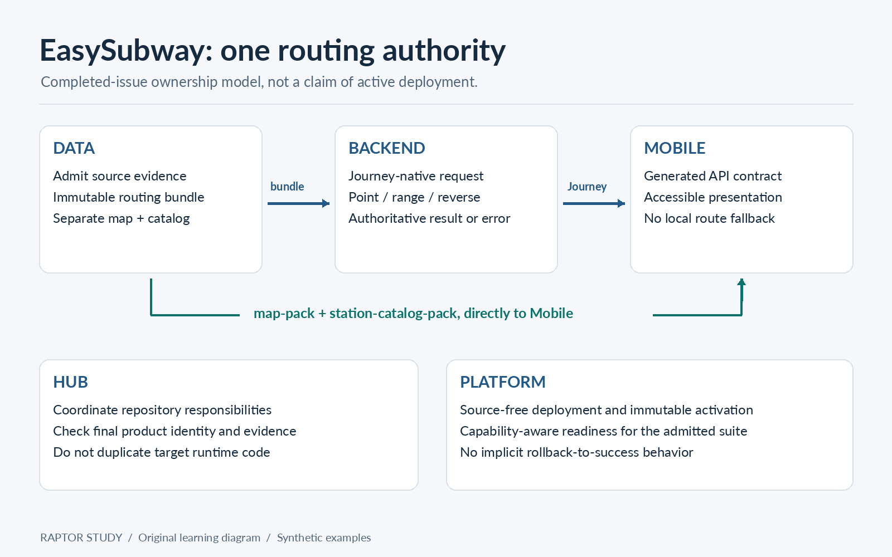

# RAPTOR Study


**A hands-on guide to round-based public transit routing, with EasySubway as the engineering context.**

Python 3.11+ · MIT · English · No algorithm runtime dependencies

Let's build the mental model first, trace a tiny network by hand, and then run the code. After that, we'll connect the algorithm to the parts that make a real journey service trustworthy: service dates, walking, accessibility, realtime identity, bounded frontiers, and honest failure behavior.

Here, **RAPTOR means the public transit routing algorithm**, not the similarly named retrieval technique for language models. This is an original learning repository, not a fork of the EasySubway production runtime.

> **Two baselines, kept separate.** The main-code observations below are pinned to EasySubway Backend `1d80b7afc58bf788dd76846ea7dc86fcb8f1cfaa`. The architecture discussion assumes the relevant EasySubway issues have been implemented, as a learning target. That assumption is not evidence that those features are deployed or active today. All runnable timetables, identifiers, and hash-shaped values in this repository are invented fixtures.

## Contents

1. [Why transit calls for rounds](#1-why-transit-calls-for-rounds)
2. [The intuition before the equations](#2-the-intuition-before-the-equations)
3. [Labels, rounds, and the core recurrence](#3-labels-rounds-and-the-core-recurrence)
4. [Marked routes and one active trip](#4-marked-routes-and-one-active-trip)
5. [Time belongs to a service day](#5-time-belongs-to-a-service-day)
6. [Walking and accessibility are part of the journey](#6-walking-and-accessibility-are-part-of-the-journey)
7. [Where RAPTOR sits in EasySubway](#7-where-raptor-sits-in-easysubway)
8. [Why the fastest label is not the whole frontier](#8-why-the-fastest-label-is-not-the-whole-frontier)
9. [Departure profiles, arrive-by, and last connection](#9-departure-profiles-arrive-by-and-last-connection)
10. [Read the paper with a purpose](#10-read-the-paper-with-a-purpose)
11. [Repository structure and learning path](#11-repository-structure-and-learning-path)
12. [Run the examples and tests](#12-run-the-examples-and-tests)
13. [Beyond the lab](#13-beyond-the-lab)
14. [References and attribution](#14-references-and-attribution)

## 1. Why transit calls for rounds

A subway map tells you where tracks go. A timetable tells you whether you can actually catch a train. Those are different questions.

Suppose you reach a platform at 08:01. A train leaving at 08:00 is no longer an option, even if its track is the shortest line on the map. Another train may arrive sooner but require an extra transfer. For a step-free journey, an elevator path may be essential rather than a small preference.

RAPTOR organizes the search around **how many vehicles you've boarded**. That makes the arrival-time/transfer tradeoff easy to inspect. Delling, Pajor, and Werneck introduced it in their 2012 paper, [Round-Based Public Transit Routing](https://www.microsoft.com/en-us/research/publication/round-based-public-transit-routing/). The paper's route scan visits an affected route at most once in a round; it is not a Dijkstra search over a road-like graph.

That does **not** mean timetable compilation disappears. Stop indexes, scan patterns, calendar admission, and trustworthy input still matter. It means the routing method doesn't depend on a heavyweight graph-shortcut preprocessing scheme just to express the basic search.

For EasySubway, the useful question is bigger than “Can RAPTOR find a fast train?” It's “Can the server return an explainable, accessible, identity-consistent journey, or fail without inventing one?”

Start with the [application decision table](docs/00_why_transit_needs_raptor.md#decide-which-raptor-model-the-request-needs)
to distinguish point, range, reverse and multicriteria requirements, their input
assumptions, and the lab evidence available for each.

## 2. The intuition before the equations

Use the invented network below. `O` and `Z` are outside-station endpoints. `A`, `X`, `Y`, and `D` are platform-side nodes. They are not real station IDs.

```text
O --ENTRY 60s--> A --R1--> X --TRANSFER 120s--> Y --R2--> D --EXIT 60s--> Z
                  \---------------- DIRECT ------------------/
```

The fixture also has a 30-second stair transfer from `X` to `Y`. Strict step-free mode excludes it. The boarding slack in the examples is **60 seconds, chosen only for this lab**.

Starting at `O` at 08:00:

| Stage | What you've established | Destination arrival |
|---|---|---|
| Round 0 | Walk from `O` to `A`; no vehicle yet | Unreached |
| Round 1 | One boarding, including the direct train | 08:30 |
| Round 2 | Two boardings, with a verified transfer | 08:22 |
| Round 3 | No improvement | Still 08:22 |

Both the 08:22 journey with one transfer and the 08:30 journey without a transfer are useful. Neither wins on both arrival time and transfer count.

Notice what the answer is **not**: “The best route takes 22 minutes, so discard everything else.” That's already a product-ranking decision. First establish the feasible alternatives; then apply the contracted frontier and display policy.

## 3. Labels, rounds, and the core recurrence

Let $\tau_k(s)$ mean the earliest known arrival at stop $s$ using **at most $k$ boardings**. An unreachable stop has value $\infty$.

Initialize round zero with the origin's ready time and all allowed walking reachability. At the start of every later round, retain the previous round:

$$\tau_k(s) \leftarrow \tau_{k-1}(s).$$

At position $i$ of a trip, boarding is possible only when

$$\tau_{k-1}(s_i) + b \leq \operatorname{dep}(t,i),$$

where $b$ is the boarding slack. For a permitted downstream alighting position $j$:

$$\tau_k(s_j) \leftarrow \min\left(\tau_k(s_j),\operatorname{arr}(t,j)\right).$$

Then close allowed walking paths without adding a boarding. The details live in [rounds, labels, and Pareto](docs/01_rounds_labels_and_pareto.md).

The subscript is the trap: **read boarding labels from round $k-1$, not from the round you're currently writing.** Otherwise, a route scanned later in the same loop can sneak in a second boarding.

For a journey with at least one boarding:

$$\text{transfers}=\text{boardings}-1.$$

A walk-only journey has zero transfers. The command-line example translates a maximum of two transfers into at most three boardings. The API in this lab deliberately calls the bound `max_boardings` so the unit is visible.


## 4. Marked routes and one active trip

Scanning every trip from every stop wastes work. After a round, mark the stops whose labels improved. For each route touching those stops, keep the earliest marked **position**, then scan that route once.

A scan pattern is not just a line name. It groups trips that share the same ordered stop sequence and compatible pickup/drop-off permissions. This implementation also requires an order in which trips do not overtake each other at any position. The compiler rejects incompatible groups instead of quietly running an invalid shortcut.

While scanning forward, keep one currently boarded trip. At the next stop, first relax its arrival. Then ask whether the previous round lets you catch an earlier trip there. If it does, switch the active trip and its immutable path witness.

The core is split across [route indexes](src/route_index.py), [route scanning](src/route_scan.py), and [the round driver](src/raptor.py). Keeping those pieces separate makes it much easier to see where a proof assumption enters the code.

Loop routes deserve special care. If a pattern visits `A` twice, its positions are distinct even though the stop ID repeats. The index stores every occurrence; it doesn't collapse them into a single station lookup.


## 5. Time belongs to a service day

`24:06:00` is a valid service-time idea: six minutes after midnight, still attached to the preceding service day's schedule. Turning it into `00:06:00` with `% 86400` loses that relationship.

The [GTFS Schedule reference](https://gtfs.org/documentation/schedule/reference/#field-types) describes service times beyond 24 hours. The lab stores integer seconds and provides an explicit Asia/Seoul date conversion. It is **not** a general GTFS importer or a global daylight-saving-time engine.

```python
from datetime import date
from src.service_time import parse_time, service_instant

seconds = parse_time("24:06:00")
assert seconds == 86760
assert service_instant(date(2026, 9, 7), seconds).isoformat() == "2026-09-08T00:06:00+09:00"
```

In the completed-issue EasySubway target, calendar exceptions, cutoff-crossing windows, predecessor-day occurrences, exact frequency semantics, and realtime applicability all belong to admission and query semantics. They cannot be repaired by a display formatter. See [service days and timetables](docs/03_service_days_and_timetables.md).

## 6. Walking and accessibility are part of the journey

The journey starts before the first train and ends after the last platform arrival. Our fixture represents ENTRY, TRANSFER, and EXIT as directed edges, so the destination arrival includes the final exit walk.

Walking closure matters. If `A -> B` and `B -> C` exist, a single pass over arbitrarily ordered edges may never discover `C`. This lab computes shortest-walk closure with a heap. That is a deliberate implementation choice for arbitrary nonnegative walking graphs; it does not turn the transit route scan into Dijkstra.

Strict step-free mode excludes known stairs. Unknown or unverified evidence triggers a typed admission failure under the lab's conservative snapshot-wide policy. This is stricter and simpler than EasySubway's richer scoped evidence model, not an implementation of that entire model.

One label per stop and round is sound here only because walking durations and boarding slack are fixed for the request, waiting is allowed, and the routing objective is arrival time plus boarding count. Incoming-line-specific transfer rules or path-dependent accessibility can require a richer state. Don't hide them in a station-level constant.

Read [transfers, accessibility, and identity](docs/05_transfers_accessibility_and_identity.md) before adapting this code to any real data.

## 7. Where RAPTOR sits in EasySubway



The learning target follows the five-repository ownership model documented in [Hub #2742](https://github.com/AquilaXk/easysubway/issues/2742) and [Hub #1393](https://github.com/AquilaXk/easysubway/issues/1393):

| Owner | What the router should receive or provide |
|---|---|
| Data | Admitted, immutable `server-route-bundle`; separate map and station-catalog products |
| Backend | The authoritative Journey calculation and typed result/failure |
| Mobile | Generated contract consumption and accessible presentation, not a local backup router |
| Platform | Source-free deployment, immutable activation, and capability-aware readiness |
| Hub | Cross-repository coordination and final evidence/identity decisions |

Here's the verified main-code anchor. At the pinned Backend commit, [`route-algorithm-v2-adr.json`](https://github.com/AquilaXk/easysubway-backend/blob/1d80b7afc58bf788dd76846ea7dc86fcb8f1cfaa/tools/routes/route-algorithm-v2-adr.json) names `EASYSUBWAY_RAPTOR_SUITE_V2`, marks the single-departure algorithm active, and marks profile modes inactive pending PR #312. That is a repository declaration, not a live deployment measurement.

The pinned [`RouteTimetableRaptorPlanner.java`](https://github.com/AquilaXk/easysubway-backend/blob/1d80b7afc58bf788dd76846ea7dc86fcb8f1cfaa/backend/src/main/java/com/easysubway/route/application/service/RouteTimetableRaptorPlanner.java) contains marked-stop collection, earliest marked pattern positions, scan workspaces, explicit access transitions, and final EXIT projection. It still receives `SearchRouteV2Command` in the inspected paths. The target in [Backend #306](https://github.com/AquilaXk/easysubway-backend/issues/306) removes that compatibility boundary from Journey-native execution.

So don't treat today's adapter shape or fixed label constants as the finished architecture. The detailed [end-to-end chapter](docs/04_easysubway_end_to_end.md) maps main-code observations to completed-issue responsibilities without claiming they're the same thing.

## 8. Why the fastest label is not the whole frontier

Compare two labels at the same stop. One arrives at 08:10 after a long walk. Another arrives at 08:11 with much less walking. Keeping only the first is fine for an earliest-arrival objective under this lab's assumptions. It is not enough to preserve a least-walking representative.

EasySubway's [Backend #307](https://github.com/AquilaXk/easysubway-backend/issues/307) defines a broader target: departure time, destination arrival, transfers, walking burden, accessibility burden, and connection slack, with versioned representative and capacity behavior.

The important separation is:

```text
public recommendation count != internal state-frontier capacity != profile work budget
```

The standalone [frontier module](src/pareto.py) demonstrates dominance, objective-vector deduplication, and failure on capacity loss. It keeps every nondominated vector or raises `RAPTOR_FRONTIER_CAPACITY_EXCEEDED`. It does **not** turn the single-label route scan into full McRAPTOR, and it does not implement every required EasySubway representative tag.

Run `python example_walking_tradeoff.py` for a concrete intermediate-stop loss:
the scalar route arrives at 30 after eight seconds of walking, while a feasible
alternative arrives at 35 after only one second of walking, with equal boardings.
Both paths are checked against the input. Notebook 03 shows why destination-only
sorting cannot restore the discarded alternative.

Never write `frontier[:3]` and call it safe merely because the app displays at most three recommendations. The missing fourth internal label might be the only one that can complete a feasible later connection.

## 9. Departure profiles, arrive-by, and last connection

A departure profile asks what changes across a ready-time window. The lab's [rRAPTOR implementation](src/profile.py) derives actual catchability events, processes them latest to earliest, retains per-round labels, and scans marked affected routes. It does **not** repeatedly call `raptor()` or sample every minute.

For our strict fixture with 60-second boarding slack:

| Ready-time interval, inclusive | Arrival / boarding alternatives |
|---|---|
| 07:59:00–08:00:00 | 08:22 / 2; 08:30 / 1 |
| 08:00:01–08:02:00 | 08:27 / 2; 08:30 / 1 |
| 08:02:01–08:05:00 | 08:27 / 2; 08:38 / 1 |
| 08:05:01–08:10:00 | 08:38 / 1 |
| 08:10:01–08:12:00 | No feasible journey |

The exact-second boundary matters: a train catchable at 08:00:00 may be missed at 08:00:01.


The [reverse implementation](src/reverse.py) scans routes backward and uses an incoming-edge index to answer arrive-by. It doesn't invent a physically reversed walkway. Last connection searches the admitted service day's real event horizon; it isn't a synonym for “search at 23:59.”

The runnable profile is intentionally limited to one admitted service date, static walking, arrival/boarding objectives, and O/D pairs that require transit. Walking-only profiles need affine, rather than just constant, arrival segments; the lab rejects that unsupported profile domain explicitly. Arrive-by and point queries do support walking-only journeys.

The full EasySubway target in [#305](https://github.com/AquilaXk/easysubway-backend/issues/305), [#308](https://github.com/AquilaXk/easysubway-backend/issues/308), [#309](https://github.com/AquilaXk/easysubway-backend/issues/309), and [#310](https://github.com/AquilaXk/easysubway-backend/issues/310) is broader. Learn the mechanics here; don't mistake this lab for that entire production contract.

## 10. Read the paper with a purpose

Open the [official paper page](https://www.microsoft.com/en-us/research/publication/round-based-public-transit-routing/) alongside the [original reading companion](papers/raptor_reading_companion.pdf) in this repository. The companion is our own guide, **not a redistributed copy of the research paper**.

On the first pass, focus on the state: what does a label mean, and what may a round read? On the second pass, trace the route scan on the fixture. On the third pass, compare the paper's transfer assumptions with our explicit walking closure. Then read the extensions with a specific question: what extra information must survive when departure time or another criterion becomes part of the problem?

The most valuable paper-reading habit is to separate an invariant from an optimization. “Board only from the previous round” is semantic. “Use a binary search over departure arrays” is an implementation choice backed by an ordering assumption.

We use original explanations and worked examples rather than decorative or unverifiable quotations.

## 11. Repository structure and learning path

The curriculum connects nine chapters, three notebooks, runnable examples and
focused tests. Each component explains a RAPTOR invariant or an EasySubway
application boundary. New learning resources can be added without a file-count cap.

```text
raptor-study/
├── .gitignore
├── LICENSE
├── README.md
├── example_journey_profiles.py
├── example_routing.py
├── example_walking_tradeoff.py
├── .github/workflows/ci.yml
├── tools/verify_notebooks.py
├── pytest.ini
├── requirements.txt
├── requirements-ci.txt
├── assets/       # 6 diagrams: 4 JPG, 2 PNG
├── docs/         # 9 numbered chapters, 00–08
├── notebooks/    # 3 executable notebooks, 01–03
├── papers/       # 1 original reading companion PDF
├── src/          # 17 Python modules
└── tests/        # invariants, raw-input witnesses, tradeoffs and oracle parity
```

The [learning resource map](docs/08_correctness_performance_and_study_plan.md#learning-resource-map)
connects concepts to executable evidence. `test_structure.py` protects required
resources and learning-material links while allowing additional files.
Notebook execution is a separate CI check.

| Stage | Read | Run or inspect |
|---|---|---|
| Build intuition | [00 — Why transit needs RAPTOR](docs/00_why_transit_needs_raptor.md) | `example_routing.py` |
| Trace the invariant | [01 — Rounds and labels](docs/01_rounds_labels_and_pareto.md) | Notebook 01 |
| Understand the scan | [02 — Marked route scanning](docs/02_marked_route_scanning.md) | `route_scan.py` |
| Admit real time semantics | [03 — Service days](docs/03_service_days_and_timetables.md) | Notebook 02 |
| Connect the service | [04 — EasySubway end to end](docs/04_easysubway_end_to_end.md) | Main/issue source matrix |
| Keep journeys trustworthy | [05 — Access and identity](docs/05_transfers_accessibility_and_identity.md) | Failure tests |
| Go beyond a point query | [06 — Profiles and reverse](docs/06_departure_profiles_and_reverse_search.md) | `example_journey_profiles.py` |
| Preserve useful alternatives | [07 — Frontiers and extensions](docs/07_multicriteria_frontiers_and_extensions.md) | Notebook 03 |
| Prove before optimizing | [08 — Correctness and study plan](docs/08_correctness_performance_and_study_plan.md) | Entire test suite |

**Implemented in this lab:** marked point RAPTOR; directed walking closure; basic hard access admission; service-time helpers; restricted label-reusing rRAPTOR; native reverse arrive-by; restricted last connection; standalone bounded objective frontier; simplified bound realtime overlay; work/deadline/cancellation failures; independent tiny-network oracle.

**Explained, not claimed as implemented:** complete Journey V3/Profile V1 wire contracts, multi-date profile merging, GTFS/frequency ingestion, full McRAPTOR state and representative tags, signed artifact verification, live providers, mobile UI, K3s activation, fare calculation, and deployed performance acceptance.

## 12. Run the examples and tests

The examples need only Python's standard library. Start from the repository root:

```bash
python3 example_routing.py
python3 example_journey_profiles.py
python3 example_walking_tradeoff.py
```

For the full learning environment:

```bash
python3 -m venv .venv
source .venv/bin/activate
python -m pip install -r requirements.txt
python example_routing.py --ready 08:00:00 --max-transfers 2
python example_routing.py --ready 08:00:00 --allow-stairs
python example_journey_profiles.py
python example_walking_tradeoff.py
python -m pytest -q
python tools/verify_notebooks.py
jupyter lab
```

On Windows PowerShell, activate with `.venv\Scripts\Activate.ps1` instead.

The dependency versions are an exercised snapshot, not a claim to be the newest packages. Core routing runs without third-party libraries. Notebook execution uses the installed Python kernel.

The test suite compares **every stop and boarding budget** against an independent state-graph oracle on seeded fixtures. Range tests also check each integer second of small windows; reverse tests exhaust feasible forward ready times. That brute-force work is test machinery, not a production fallback.

`Journey.validate()` checks internal chronology; `validate_against(timetable,
boarding_slack=60, policy=policy)` additionally verifies every ride and directed
walk against the supplied post-overlay timetable and request policy. The tests
include corrupted witnesses that would pass chronology alone. This input check
does not prove optimality, signature validity or deployed identity binding.

A failed admission, exhausted budget, cancellation, or stale overlay raises a typed error. An admitted search with no feasible journey returns an empty result. Neither path returns a previously successful route.

## 13. Beyond the lab

Keep this repository separate from the five EasySubway product repositories. It teaches the algorithm and the surrounding contracts; it should not become a new provider service or another routing authority.

The [CI workflow](.github/workflows/ci.yml) runs the full test suite, all three
examples and fresh notebook kernels on Python 3.11.14 and 3.14.6. It uses read-only
repository permissions and commit-pinned actions. Notebook outputs are cleared
in memory before execution; stored output is never treated as fresh evidence.
For verification without the JupyterLab UI, install `requirements-ci.txt`.
The delivery's initial-publishing script stays outside the source tree.

The publishing script proposes a private repository by default, a `main` branch, issues and discussions enabled, wiki and projects disabled, squash-only merging, automatic merged-branch cleanup, and relevant repository topics. It can request main-branch protection explicitly. Actual remote settings must be read back after creation; none should be described as applied merely because a script exists.

For a contribution, reproduce the problem with a tiny fixture first. Add a failing invariant or oracle test, make the smallest implementation change, and explain its assumptions. Never “fix” a test by weakening strict accessibility, silently capping a frontier, fabricating source data, or adding a success fallback.

Do not commit credentials, official feeds without redistribution rights, passenger information, live artifact payloads, or production evidence into the examples. Report a suspected security issue privately rather than pasting a secret into a public issue.

## 14. References and attribution

**Research.** Daniel Delling, Thomas Pajor, and Renato F. Werneck, *Round-Based Public Transit Routing*, ALENEX 2012. [Official publication page](https://www.microsoft.com/en-us/research/publication/round-based-public-transit-routing/) · [Official PDF](https://www.microsoft.com/en-us/research/wp-content/uploads/2012/01/raptor_alenex.pdf).

**Timetable semantics.** [GTFS Schedule reference](https://gtfs.org/documentation/schedule/reference/), especially service times, stop times, calendars, frequencies, and transfers. The toy schema is intentionally smaller and is not described as GTFS compliant.

**Project context.** EasySubway main and linked issue targets, reviewed on **September 7, 2026**. [Chapter 04](docs/04_easysubway_end_to_end.md#source-and-assumption-register) records the source and assumption boundary. Issue pages can change; the Backend main-code observations use immutable commit links.

```bibtex
@inproceedings{delling2012round,
  author    = {Daniel Delling and Thomas Pajor and Renato F. Werneck},
  title     = {Round-Based Public Transit Routing},
  booktitle = {Proceedings of the Meeting on Algorithm Engineering and Experiments},
  year      = {2012},
  publisher = {Society for Industrial and Applied Mathematics},
  url       = {https://www.microsoft.com/en-us/research/publication/round-based-public-transit-routing/}
}
```

Original material in this repository is available under the [MIT license](LICENSE). Linked sources keep their own licenses and ownership.
