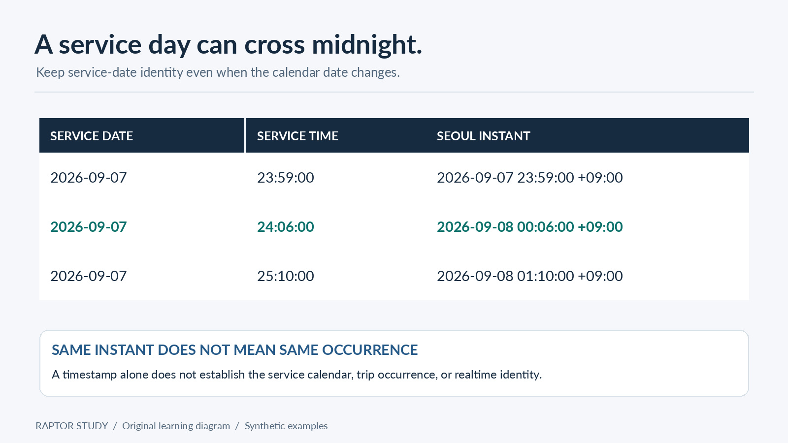

# 03 — Service days and timetables

[Previous](02_marked_route_scanning.md) · [Guide](../README.md) · [Next](04_easysubway_end_to_end.md)

## A time needs an identity

A plain `00:06` string doesn't tell you which service occurrence it belongs to. An overnight trip from the preceding service date and a new day's early trip can both appear near midnight. Mixing them can attach a realtime update to the wrong run or search the wrong calendar.

The lab models a timetable as one already-admitted service date. Its trip times are integer seconds that may exceed 86,400. `service_instant` converts those seconds using Asia/Seoul, and its documentation explicitly excludes global GTFS daylight-saving behavior.

The [GTFS reference](https://gtfs.org/documentation/schedule/reference/#field-types) explains the distinction between service time and local wall-clock time. The important practical lesson here is simple: do not reduce service seconds modulo one day and then try to reconstruct the lost date later.

## What the toy compiler accepts

`Timetable` validates unique stop IDs, route IDs, and trip IDs. Each trip has matching arrival/departure arrays with at least two positions. Arrival cannot follow departure at a position, and departure cannot move backward into the next arrival. Pattern lengths must match, all referenced stops must exist, and walking durations must be nonnegative.

These checks catch malformed fixtures. They do not establish source authority, freshness, geography, licensing, or coverage. A 64-character hash-shaped string is a useful identity field in an example, but its shape is not a signature and its presence is not provenance.

The fixture's repeated `a` characters are deliberately fake. Never promote them to an artifact identity outside the lab.

## Calendar exceptions are not a display feature

A weekly calendar says which weekdays normally operate. An explicit exception can add or remove a service on a particular date. `service_active` demonstrates that override order.

A multi-date extension must select every service date whose trips could intersect the request window. An overnight occurrence may start on the preceding date and end after midnight. A cutoff can help identify candidate dates; it is not the last train time. Keep each occurrence attached to its original date, apply its calendar exceptions, and combine dates only from one consistent input generation.

The lab does not implement that multi-date loader or merger. Its `rraptor` function receives one resolved timetable. That scope is deliberate and visible rather than hidden behind an approximate date loop.

## Frequency services need an explicit contract

A headway description isn't automatically an exact list of train departures. Before claiming exact catchability, a production importer must say whether it expands exact scheduled instances, uses another admitted exact selection model, or cannot support that source in the requested mode.

Our fixtures contain explicit trips only. We do not generate plausible trains from incomplete data. This keeps the algorithm exercise honest while leaving the source-ingestion problem where it belongs.

For optional input-format background, see [GTFS frequencies](https://gtfs.org/documentation/schedule/reference/#frequenciestxt). The local rule is sufficient for this lab: only explicit, validated trip events enter the router; a headway alone does not create a boardable departure.

## Realtime occurrence identity

The same trip ID can occur on different service dates. In a multi-day system, a safe occurrence identity needs enough context to distinguish those runs and their scheduled stop events. A date-less map from `tripId` to delay can update the wrong train.

`Snapshot` deliberately binds its toy updates to one bundle and one service date. Within that already-resolved day, trip IDs are unique. It supports whole-trip nonnegative delays and cancellations only. It does not model stop-specific delay propagation, partial occurrence coverage, provider applicability, or a production validity policy.

`apply_snapshot` rejects a different bundle/day, an unknown occurrence, or an expired/future observation. It revalidates the no-overtaking pattern after applying updates. A missing update for a known trip inside a valid snapshot means unchanged under this toy contract; it is not permission to substitute a stale or absent snapshot.

## Input validation is not source verification

[fixtures.py](../src/fixtures.py) constructs invented input, [timetable.py](../src/timetable.py) validates its structure, and [route_index.py](../src/route_index.py) compiles it. These stages do not download feeds or verify external evidence.

A future importer would need to establish where each trip and stop sequence came from, which dates it covers, and whether updates refer to those same occurrences. A downloaded row count alone cannot establish completeness. The current lab makes no claim about real service coverage.

## Exercise and answer

Compare `2026-09-07 + 24:06:00` with `2026-09-08 + 00:06:00`. They can name the same instant in Seoul, but they need not name the same service occurrence. Instant equality alone does not authorize attaching the same calendar or realtime record.

Then run notebook [02](../notebooks/02_service_days_and_profiles.ipynb). Watch the departure-profile boundary at exactly 08:00:00. A second matters even though the UI may display minutes.
